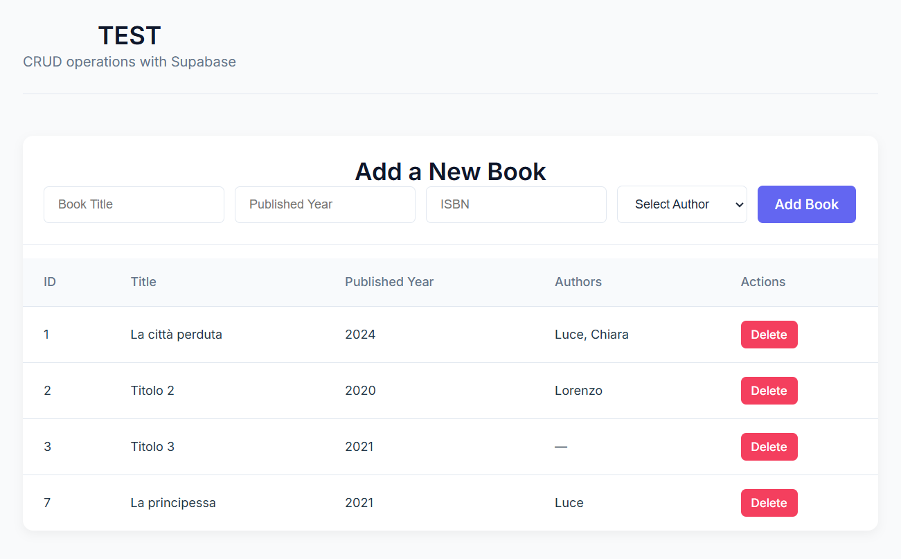

# Supabase + React + TypeScript TEST



A test application built with React, TypeScript, to learn [Supabase](https://supabase.com/). This project demonstrates how to use Supabase as a backend for a simple book and author management system.
The application allows users to view, add, and delete books, as well as manage the relationships with authors.


### Prerequisites
- Node.js (v18 or newer)
- Supabase account and project

### Installation and usage

1. Clone the repository and Install dependencies:`npm install`
2. Create a `.env` file in the root directory with your Supabase credentials:
   ```
   VITE_SUPABASE_URL=your_supabase_url
   VITE_SUPABASE_ANON_KEY=your_supabase_anon_key
   ```

3. Start the development server: `npm run dev`and open your browser and visit `http://localhost:5173`

## Database Schema

The application uses the following Supabase table structure:

### Tables

1. **Libri (Books)**
   - `id`: Primary key
   - `titolo`: Book title
   - `published_year`: Year of publication
   - `isbn`: ISBN identifier

2. **Autori (Authors)**
   - `id`: Primary key
   - `name`: Author's name
   - `bio`: Author's biography
   - `birth_year`: Author's birth year

3. **book_authors (Junction Table)**
   - `book_id`: Foreign key to Libri with ON DELETE CASCADE
   - `author_id`: Foreign key to Autori with ON DELETE CASCADE


## License
This project is licensed under the MIT License. See the [LICENSE](LICENSE) file for details.